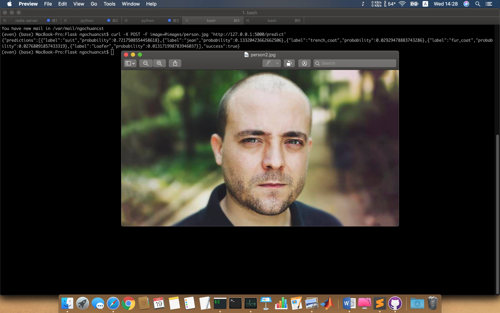
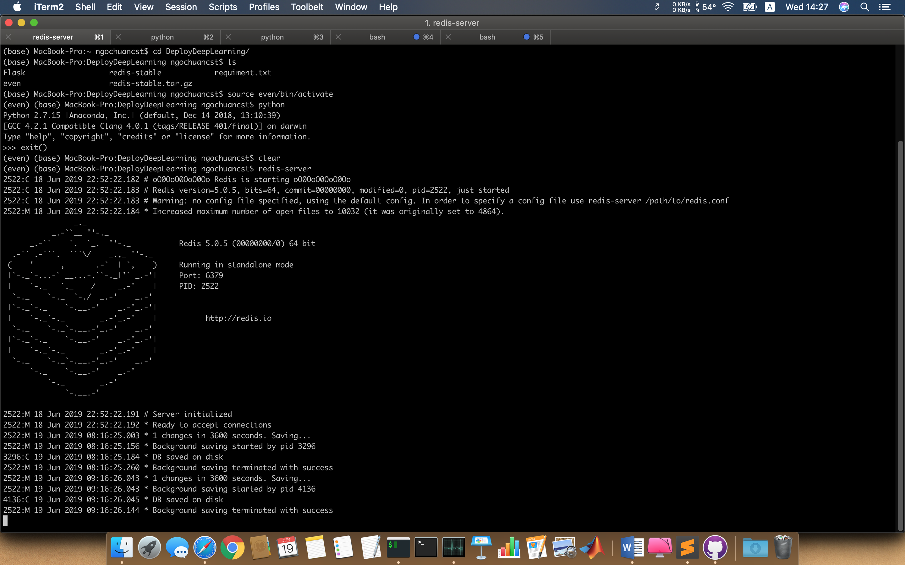
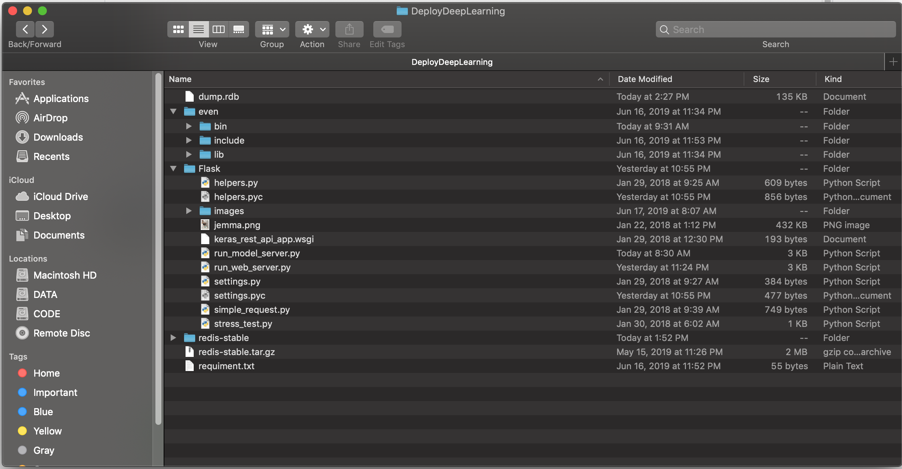
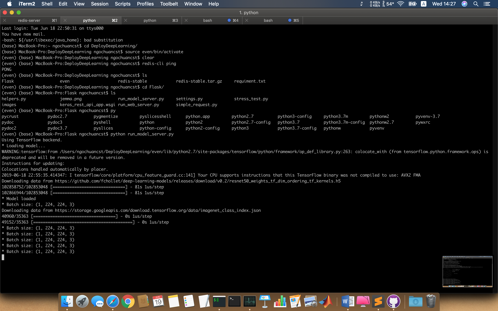
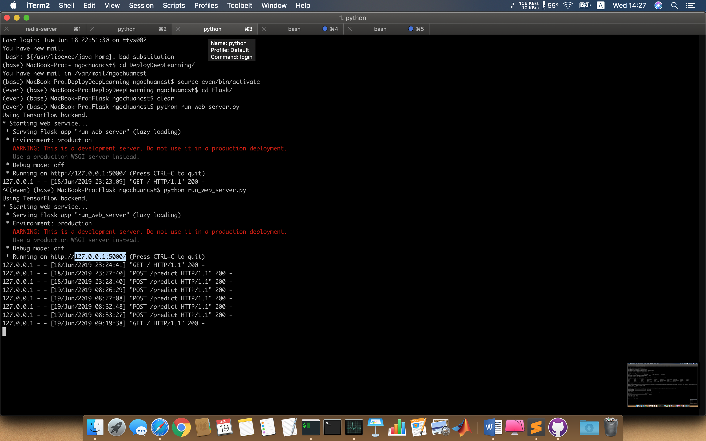
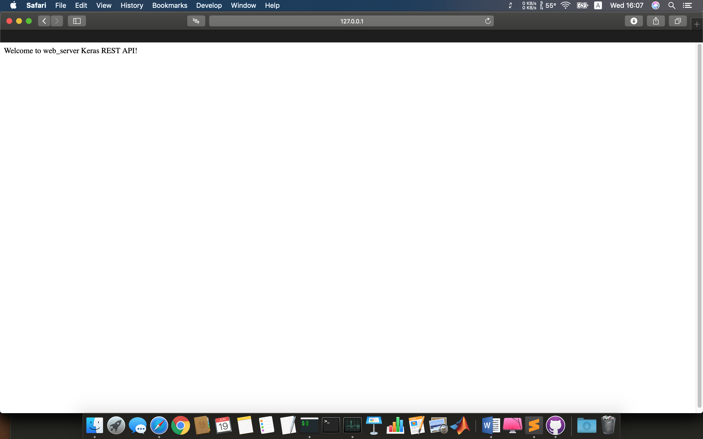
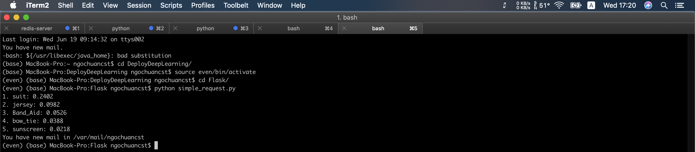

# Object Detection with Keras, Redis, Flask, Using ResNet50 Backbone on ImageNet.

## Kiến Trúc Hệ Thống
 * **Keras** dùng trong việc training các giải thuật Deep Learning.
 * **Flask** là một framework rất đơn giản để dùng để viết Web Service bằng ngôn ngữ Python.
 * **Redis** sử dụng để caching mô hình Deep Learning trên môi trường production.
 

## Cài Đặt Môi Trường.
**NOTE: mỗi khi khởi tạo server và test thì ta mở một terminal mới.**
### Cài đặt và cấu hình Redis

   **Redis** là một công cụ khá phổ biến và bạn có thể dễ dàng cài đặt nó trong phần sau:
   
    $ wget http://download.redis.io/redis-stable.tar.gz
    $ tar xvzf redis-stable.tar.gz
    $ cd redis-stable
    $ make
    $ sudo make install
   Để khởi động **Redis** chúng ta có thể sử dụng câu lệnh sau
   
    $ redis-server
    
   Sử dụng câu lệnh sau để test sự hoạt động của Redis: Nếu có 'PONG' là thành công .
   
    $ redis-cli ping
      PONG

### Cấu hình virtualenv để chạy ứng dụng

Các bạn sử dụng các thư viện sau trong suốt quá trình thực hiện Project này. Tạo một [**virtualenv**](https://virtualenv.pypa.io/en/stable/) để cài đặt các package cần thiết sau:

    $ pip install numpy
    $ pip install scipy h5py
    $ pip install tensorflow # tensorflow-gpu for GPU machines
    $ pip install keras
    $ pip install flask gevent
    $ pip install imutils requests
    $ pip install redis
    $ pip install Pillow
Trong ứng dụng demo về nhận diện ảnh nhưng chúng ta không cần sử dụng thư viện OpenCV mà chỉ cần sử dụng PIL thay cho nó vì chủ yếu chúng ta xử lý ảnh dựa trên kiểu Bytes tức là truyền lên sử dụng Base64 mà thư viện PIL xử lý rất tốt vấn đề này. Sau đây sẽ bàn về luồng xử lý ứng dụng REST API cho Deep Learning.

## Cấu trúc thư mục Flask

Sau khi cài đặt **Flask** ta tổ chức các file code theo cấu trúc sau:

* Trong đó:

	* File `run_web_server.py`: chứa tất cả code của Flask web server code.
	* File `run_model_server.py`: thực hiện các công việc
		* Load Keras model dưới dạng file **h5** và **json**
		* Liên tục truy cập vào Redis để lấy thông tin các ảnh gửi tới qua web request và tiến hành phân loại ảnh
		* Ghi kết quả phân loại vào Redis
	* `settings.py`: chứa tất cả các cài đặt cần thiết
	* `keras_rest_api_app.wsgi`: chứa các WSGI setting giúp chạy ứng dụng Flask trên môi trường Apache server.
	* `simple_request.py`: Sử dụng để điều hướng các request thông qua REST API
	
## Khởi chạy server

Các bạn trước tiên cần khởi chạy file run_model_server.py trên một screen riêng bằng câu lệnh sau:

	$ python run_model_server.py
	* Loading model...
	...
	* Model loaded
	

	
Lúc này Redis đã sẵn sàng lắng nghe các dữ liệu base64 được gửi từ Flask. Việc tiếp theo là cần khởi chạy server Flask trên một screen khác.

	$ python run_web_server.py 
	Using TensorFlow backend.
 	* Loading Keras model and Flask starting server...please wait until server has fully started
	...
	 * Running on http://127.0.0.1:5000

* Kiểm tra xem, chúng ta đã khởi tạo môi trường thành công chưa ?

 

* Như Hình trên thì đã thành công .
	 
## Testing

* Sử dụng cURL test Keras REST API

**run**

curl -X POST -F image=@images/person.jpg 'http://127.0.0.1:5000/predict

**OUPUT**

{"predictions":[{"label":"suit","probability":0.7217508554458618},
{"label":"jean","probability":0.13320423662662506},
{"label":"trench_coat","probability":0.02929478883743286},
{"label":"fur_coat","probability":0.02768091857433319},
{"label":"Loafer","probability":0.013171998783946037}],"success":true} 

# Bạn có thể run Scrip sau để đưa ra đối tượng 

	`python simple_request.py` 
	1. suit: 0.2402
	2. jersey: 0.0982
	3. Band_Aid: 0.0526
	4. bow_tie: 0.0388
	5. sunscreen: 0.0218

* contact me: ngochuanktkt@gmail.com
Good Luck !
#THE END. 

